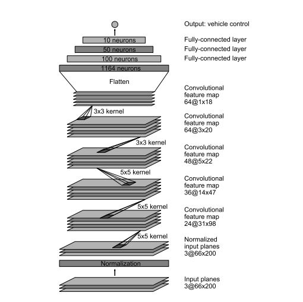
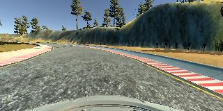
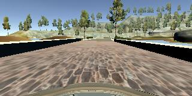

# Behavioral Cloning Project

[](http://www.udacity.com/drive)

Overview
---
This repository contains starting files for the Behavioral Cloning Project.

In this project, you will use what you've learned about deep neural networks and convolutional neural networks to clone driving behavior. You will train, validate and test a model using Keras. The model will output a steering angle to an autonomous vehicle.

We have provided a simulator where you can steer a car around a track for data collection. You'll use image data and steering angles to train a neural network and then use this model to drive the car autonomously around the track.

We also want you to create a detailed writeup of the project. Check out the [writeup template](https://github.com/udacity/CarND-Behavioral-Cloning-P3/blob/master/writeup_template.md) for this project and use it as a starting point for creating your own writeup. The writeup can be either a markdown file or a pdf document.

To meet specifications, the project will require submitting five files: 
* model.py (script used to create and train the model)
* drive.py (script to drive the car - feel free to modify this file)
* model.h5 (a trained Keras model)
* a report writeup file (either markdown or pdf)
* video.mp4 (a video recording of your vehicle driving autonomously around the track for at least one full lap)

This README file describes how to output the video in the "Details About Files In This Directory" section.

The Project
---
The goals / steps of this project are the following:
* Use the simulator to collect data of good driving behavior 
* Design, train and validate a model that predicts a steering angle from image data
* Use the model to drive the vehicle autonomously around the first track in the simulator. The vehicle should remain on the road for an entire loop around the track.
* Summarize the results with a written report

### Dependencies
This lab requires:

* [CarND Term1 Starter Kit](https://github.com/udacity/CarND-Term1-Starter-Kit)

The lab enviroment can be created with CarND Term1 Starter Kit. Click [here](https://github.com/udacity/CarND-Term1-Starter-Kit/blob/master/README.md) for the details.

The following resources can be found in this github repository:
* drive.py
* video.py
* writeup_template.md

The simulator can be downloaded from the classroom. In the classroom, we have also provided sample data that you can optionally use to help train your model.

## Details About Files In This Directory

### `drive.py`

Usage of `drive.py` requires you have saved the trained model as an h5 file, i.e. `model.h5`. See the [Keras documentation](https://keras.io/getting-started/faq/#how-can-i-save-a-keras-model) for how to create this file using the following command:
```sh
model.save(filepath)
```

Once the model has been saved, it can be used with drive.py using this command:

```sh
python drive.py model.h5
```

The above command will load the trained model and use the model to make predictions on individual images in real-time and send the predicted angle back to the server via a websocket connection.

Note: There is known local system's setting issue with replacing "," with "." when using drive.py. When this happens it can make predicted steering values clipped to max/min values. If this occurs, a known fix for this is to add "export LANG=en_US.utf8" to the bashrc file.

#### Saving a video of the autonomous agent

```sh
python drive.py model.h5 run1
```

The fourth argument, `run1`, is the directory in which to save the images seen by the agent. If the directory already exists, it'll be overwritten.

```sh
ls run1

[2017-01-09 16:10:23 EST]  12KiB 2017_01_09_21_10_23_424.jpg
[2017-01-09 16:10:23 EST]  12KiB 2017_01_09_21_10_23_451.jpg
[2017-01-09 16:10:23 EST]  12KiB 2017_01_09_21_10_23_477.jpg
[2017-01-09 16:10:23 EST]  12KiB 2017_01_09_21_10_23_528.jpg
[2017-01-09 16:10:23 EST]  12KiB 2017_01_09_21_10_23_573.jpg
[2017-01-09 16:10:23 EST]  12KiB 2017_01_09_21_10_23_618.jpg
[2017-01-09 16:10:23 EST]  12KiB 2017_01_09_21_10_23_697.jpg
[2017-01-09 16:10:23 EST]  12KiB 2017_01_09_21_10_23_723.jpg
[2017-01-09 16:10:23 EST]  12KiB 2017_01_09_21_10_23_749.jpg
[2017-01-09 16:10:23 EST]  12KiB 2017_01_09_21_10_23_817.jpg
...
```

The image file name is a timestamp of when the image was seen. This information is used by `video.py` to create a chronological video of the agent driving.

### `video.py`

```sh
python video.py run1
```

Creates a video based on images found in the `run1` directory. The name of the video will be the name of the directory followed by `'.mp4'`, so, in this case the video will be `run1.mp4`.

Optionally, one can specify the FPS (frames per second) of the video:

```sh
python video.py run1 --fps 48
```

Will run the video at 48 FPS. The default FPS is 60.

#### Why create a video

1. It's been noted the simulator might perform differently based on the hardware. So if your model drives succesfully on your machine it might not on another machine (your reviewer). Saving a video is a solid backup in case this happens.
2. You could slightly alter the code in `drive.py` and/or `video.py` to create a video of what your model sees after the image is processed (may be helpful for debugging).

### Tips
- Please keep in mind that training images are loaded in BGR colorspace using cv2 while drive.py load images in RGB to predict the steering angles.

---

## Project Writeup

#### 1. Submission includes all required files and can be used to run the simulator in autonomous mode

My project includes the following files:

- model.py containing the script to create and train the model
- model.ipynb python notebook containing the code to create and train the model
- drive.py for driving the car in autonomous mode
- model.h5 containing a trained convolution neural network 
- writeup_report.md  summarizing the results

#### 2. Submission includes functional code

Using the Udacity provided simulator and my drive.py file, the car can be driven autonomously around the track by executing 

```sh
python drive.py model.h5
```

#### 3. Submission code is usable and readable

The model.py file contains the code for training and saving the convolution neural network. The file shows the pipeline I used for training and validating the model.

---

## Model Architecture and Training Strategy

### Model Overview

- The model architecture build with references to [NVIDIA  - End to End Learning for Self-Driving Cars ](https://images.nvidia.com/content/tegra/automotive/images/2016/solutions/pdf/end-to-end-dl-using-px.pdf) 
  This model takes input images with shape `[60, 266, 3]` but our generated images are shape `[160, 320,3]`. Hence input shape given to this model is changed 




### Loading Data

- I used my own dataset.

- OpenCV library read images in BGR format, converted them to RGB format because drive.py processes in RGB format too.

- We have steering angle associated with three images, As steering angle is capture by the center angle, we can add correction factor for left and right images.

- Introduced correction factor of `+/- 0.2` 

- Left images : increased steering angle `+0.2`and right images: decreased steering angle by `-0.2`

  ​			Following is sample image capture by simulator,



### Preprocessing

- Shuffling images: to make CNN more robust to independent of order in which images come next.
- Data augmentation: Getting appropriate steering angle by flipping image horizontally using cv2 with factor of `-1`.
- With this approach I generated 6 more images for each entry in .csv

### Creation of the Training Set & Validation Set

- I split dataset as follows validation dataset: `15%` and training dataset: `85%`

- To avoid loading all the images in the memory at once, I used generator to generate the data at runtime in batches of `32` with all augmented images.

### Revised Model Architecture

|           Layer (Type)           |    Output Shape     | Param # |      Connected to       |
| :------------------------------: | :-----------------: | :-----: | :---------------------: |
|        lambda_3 (Lambda)         | (None, 160, 320, 3) |    0    | lambda_input_3 \[0][0]  |
|    cropping2d_3 (Cropping2D)     | (None, 65, 320, 3)  |    0    |     lambda_3\[0][0]     |
| convolution2d_11 (Convolution2D) | (None, 31, 158, 24) |  1824   |  cropping2d_3 \[0][0]   |
|    activation_17 (Activation)    | (None, 31, 158, 24) |    0    | convolution2d_11\[0][0] |
| convolution2d_12 (Convolution2D) | (None, 14, 77, 36)  |  21636  |  activation_17\[0][0]   |
|    activation_18 (Activation)    | (None, 14, 77, 36)  |    0    | convolution2d_12\[0][0] |
| convolution2d_13 (Convolution2D) |  (None, 5, 37, 48)  |  43248  |  activation_18\[0][0]   |
|    activation_19 (Activation)    |  (None, 5, 37, 48)  |    0    | convolution2d_13\[0][0] |
| convolution2d_14 (Convolution2D) |  (None, 3, 35, 64)  |  27712  |  activation_19\[0][0]   |
|    activation_20 (Activation)    |  (None, 3, 35, 64)  |    0    | convolution2d_14\[0][0] |
| convolution2d_15 (Convolution2D) |  (None, 1, 33, 64)  |  36928  |  activation_20\[0][0]   |
|    activation_21 (Activation)    |  (None, 1, 33, 64)  |    0    | convolution2d_15\[0][0] |
|       flatten_3 (Flatten)        |    (None, 2112)     |    0    |  activation_21\[0][0]   |
|         dense_9 (Dense)          |     (None, 100)     | 211300  |    flatten_3\[0][0]     |
|    activation_22 (Activation)    |     (None, 100)     |    0    |     dense_9\[0][0]      |
|       dropout_3 (Dropout)        |     (None, 100)     |    0    |  activation_22\[0][0]   |
|         dense_10 (Dense)         |     (None, 50)      |  5050   |    dropout_3\[0][0]     |
|    activation_23 (Activation)    |     (None, 50)      |    0    |     dense_10\[0][0]     |
|         dense_11 (Dense)         |     (None, 10)      |   510   |  activation_23\[0][0]   |
|    activation_24 (Activation)    |     (None, 10)      |    0    |     dense_11\[0][0]     |
|         dense_12 (Dense)         |      (None, 1)      |   11    |  activation_24\[0][0]   |

- I have applied normalization to all the images

- To remove trees and sky, cropped image from top by `70pixels` and to remove dashboard from image cropped images from bottom by `25pixels`.

  ​				

  ​					sample image and cropped image




- Next Step is to define the first convolutional layer with filter depth as 24 and filter size as (5,5) with (2,2) stride followed by ELU activation function
- Moving on to the second convolutional layer with filter depth as 36 and filter size as (5,5) with (2,2) stride followed by ELU activation function 
- The third convolutional layer with filter depth as 48 and filter size as (5,5) with (2,2) stride followed by ELU activation function
- Next we define two convolutional layer with filter depth as 64 and filter size as (3,3) and (1,1) stride followed by ELU activation funciton
- Next step is to flatten the output from 2D to side by side
- Here we apply first fully connected layer with 100 outputs
- Here is the first time when we introduce Dropout with Dropout rate as 0.25 to combact overfitting
- Next we introduce second fully connected layer with 50 outputs
- Then comes a third connected layer with 10 outputs
- And finally the layer with one output.

Reason for having only one output because we want to predict is the steering angle.

#### Overfitting 

- applied Dropout layer after fully connected layer with `0.25` dropout rate.

### Model parameter tuning 

- Number of epochs: `1`
- Optimizer: `Adam Optimizer`
- Learning Rate: `0.001`
- Validation Data split: `0.15`
- Batch size: `32`
- Correction factor: `0.2`
- Loss Function: basic `Mean Sqaured Error` (regression problem)

### OUTPUT video

- [Output video for generated dataset](./run2.mp4)
- [Output video for udacity dataset](./run1.mp4)

